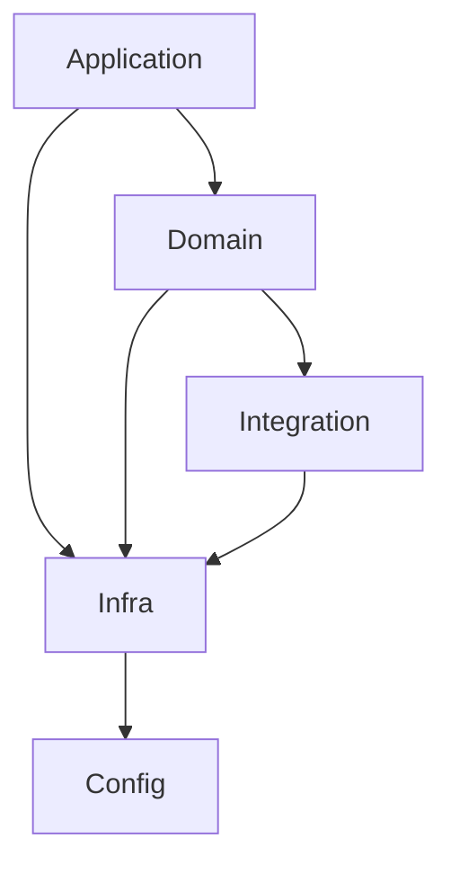

# example-backend-nestjs

Este projeto tem como objetivo prover:
- **Exemplo completo de uma aplicação backend**, organizado a partir do uso de [DDD](https://omegaenergiarenovavel.sharepoint.com/sites/OMCDigital140/SitePages/DDD.aspx), [camadas e padrões de arquitetura](https://omegaenergiarenovavel.sharepoint.com/sites/OMCDigital140/SitePages/Camadas.aspx) que permite uma estruturação do projeto como um serviço com foco em negócio.
- **Template para criação de novos projetos**, permitindo que novos projetos de backend estruturados como serviço possam nascer já com uma estrutura mínima adequada e padronizada.

## O projeto, como um exemplo

Para utilizar/analisar este projeto como exemplo, é indicado que o mesmo seja visto a partir da [**branch main**](https://github.com/omega-energia/example-backend-nestjs/tree/main), onde o README do projeto detalha as características do mesmo.

## O projeto, como um template

A branch default deste projeto, de nome "template", possui código genérico configurado para que novos projetos sejam criados a partir dele. Para possibilitar seu uso como template, foi adotado o mecanismo de [templates do github](https://docs.github.com/en/repositories/creating-and-managing-repositories/creating-a-template-repository).

**Para criar um novo projeto**, use a opção "Use this template", conforme figura abaixo, e/ou leia as [instruções completas aqui](https://docs.github.com/en/repositories/creating-and-managing-repositories/creating-a-repository-from-a-template)

Após a criação do projeto, uma action do github actions será executada automaticamente para que o setup do projeto seja aplicado com:    
- renomeação de artefatos do template com o nome escolhido para o projeto.
- reorganização de arquivos e branches focando no projeto como uma aplicação "do zero".

Para acompanhar a execução da action, basta acessar a aba "Actions" do projeto criado, e nela haverá 1 workflow em execução ou já executado com o nome "Configure the project from the template". Estando o workflow executado, basta acessar/atualizar a página principal do projeto.

--- 

### Itens padrões do template de backend

- Diretórios/módulos organizados seguindo a abordagem de [DDD](https://omegaenergiarenovavel.sharepoint.com/sites/OMCDigital140/SitePages/DDD.aspx).

- Diretório com código da aplicação (`src`) e testes (`tests`) isolados, sendo cada um com seu objetivo bem definido.

- Raiz do projeto contendo apenas artefatos de configuração do build/estruturação do projeto. Configurações direcionadas ao sistema ficam em `src`, e de testes, ficam em `tests`.

- `src` organizado com módulos na raiz seguindo a [estrutura de camadas padrão de DDD](https://omegaenergiarenovavel.sharepoint.com/sites/OMCDigital140/SitePages/Camadas.aspx#camadas-seguindo-ddd), e módulos adicionais de apoio:
    - módulo config: Contém apenas arquivos com configurações do sistema/frameworks. Pode ser importado no código a partir de **@config**.
    - módulo [infra](https://omegaenergiarenovavel.sharepoint.com/sites/OMCDigital140/SitePages/Camadas.aspx#infra): Contém implementações de infraestrurtura do software que servem como base/apoio e/ou utilitários. Pode ser importado no código a partir de **@infra**.
    - módulo [domain](https://omegaenergiarenovavel.sharepoint.com/sites/OMCDigital140/SitePages/Camadas.aspx#domain): Contém implementações focadas em negócio e persistência de dados. Nele faz-se uso de padrões de arquitetura como **Services, Repositories, Entities**.
    - módulo [application](https://omegaenergiarenovavel.sharepoint.com/sites/OMCDigital140/SitePages/Camadas.aspx#application): Contém implementações relacionadas a como é exposta/acessada as funcionalidades da aplicação, como **API's, Eventos, etc.**. Nele faz-se uso de padrões de arquitetura como **Controllers e DTO's**.
    - módulo integration: Contém código relacionados a integração com sistemas externos a aplicação, sejam eles outras aplicações da plataforma Omega como aplicações de outros domínios, ou sistemas externos de terceiros. Nele estarão as interfaces utilizadas pela camada domain, e as implementações concretas de integração com as demais aplicações, que devem ser isoladas e não importadas pelos demais módulos. Leia [injeção e inversão de dependência](https://omegaenergiarenovavel.sharepoint.com/sites/OMCDigital140/SitePages/Inje%C3%A7%C3%A3o.aspx).

    Dependência esperada entre os módulos:

- `@config`, com arquivos de configuração separados por objetivo, sendo:
    - application, com configurações gerais da aplicação.
    - autenticação, com configurações de autenticação relacionadas a quem acessa a aplicação.
    - banco de dados, com as configurações para uso do TypeORM e conexão com banco postgres.
    - mensageria/filas, com configurações para uso de mensageria e conexão com redis.

- `@infra`, com implementação padrão sobre:
    - **Configurações**, usando o padrão de [configurações indicado pelo NestJS](https://docs.nestjs.com/techniques/configuration).
    - **Autenticação**, provendo implementação [padrão do NestJS, fazendo uso de `UseGuards`](https://docs.nestjs.com/security/authentication), com estratégias prontas para autenticação via **Auth0 e Azure**.
    - **Banco de dados**, provendo um modelo padrão de conexão com banco de dados usando @nestjs/config, e incluindo o uso de:
        - Bibliteca para trabalhar com transações nos services/repositories [typeorm-transactional](https://www.npmjs.com/package/typeorm-transactional).
        - Utilitário para configuração automática de validação de entidades através do uso de [class-validator](https://www.npmjs.com/package/class-validator).
        - Migrações do banco de dados, que são aplicadas automaticamente ao executar a aplicação.
    - **Tratamento de Erros**, provendo filtros padrões para erros/exceções que são disparadas pela camada domain e são formatados na camada application.
    - **Eventos do domínio**, provendo decorador padrão para viabilizar a publicação de eventos da camada domain, que podem ser observados pela camada application.

- `@domain`, com módulos iniciais que representam os contextos do domínio, e neles os Services, Repositories, Entities e outros artefatos relacionados a composição do domínio e regras de negócio, podendo estar se desejado/necessário também agrupados em submódulos que representem subcontextos ou entidades do domínio.

- `@application`, com módulos iniciais focados em:
    - **api/rest**, contendo:
        - módulos organizados por contextos
        - local adequado para implementação de Controllers e DTOs.
        - Uso do [RouterModule do NestJS](https://docs.nestjs.com/recipes/router-module) para configuração das raizes de rotas por contexto.
        - Geração automática de documentação [OpenAPI/Swagger](https://docs.nestjs.com/openapi/introduction).
    - **health**, provendo implementação padrão para verificação de saúde da aplicação. Por padrão já traz verificações para banco de dados e serviço de cache/mensageria.
    - **queue**, provendo o local adequado para implementação de producers e processor do [Bull](https://www.npmjs.com/package/bull).
        - No caso de producers, estes devem ser implementados usando o gatilho de eventos do domínio [@OnEvent()](https://docs.nestjs.com/techniques/events).
        - No caso de processors, estes devem apenas receber as notificações de uma fila e o objeto a ser processado, e chamar implementações do domínio através de services.
    - **event-bus**, provendo o local adequado para implementação de consumers e publishers relacionados ao [barramento de eventos](https://omegaenergiarenovavel.sharepoint.com/sites/OMCDigital140/SitePages/Eventos.aspx).
        - No caso de producers, estes devem ser implementados usando o gatilho de eventos do domínio [@OnEvent()](https://docs.nestjs.com/techniques/events).
        - No caso de consumers, estes devem apenas receber as notificações do barramento e o objeto a ser processado, e chamar implementações do domínio através de services.

- `tests` organizando os artefatos de testes, trazendo já configurado:
    - relatório de cobertura em `/report/coverage/lcov-report/index.html`.
    - relatório de testes no diretório `/report/test.html`.
    - testes de integração e componentes configurados para serem executados em único comando.
    - Setup/migração do banco de dados a cada execução dos testes, garantido integridade do ambiente de testes.
    - Fixtures (cenários de dados) sendo carregadas uma única vez no inicio da bateria de testes.
    - Utilitários de transações do banco de dados, isolando cada testes e não efetivando commits no banco para não poluir os cenários de testes.

- Target para geração do diagrama de dependência entre módulos, usando a biblioteca [dependency-cruiser](https://github.com/sverweij/dependency-cruiser).

- Uso de arquivos `.env` com as configurações específicas por ambiente, tendo por padrão:
    - `.env.docker`, com variáveis usadas pelo sistema quando este é executado via docker (tanto execução da aplicação, quanto testes).
    - `.env.test`, com variáveis usadas durante a execução dos testes (seja local ou via docker).
    - `.env.example`, este servindo como exemplo para ser copiado localmente apenas com nome `.env` para quando se desejar rodar a aplicação localmente (sem usar docker).

- Docker-compose para rodar o serviço, testes e terminal de console, sendo que as instruções de uso aparecem no README do projeto a ser criado a partir deste template. (e também na branch main que contém os exemplos).

